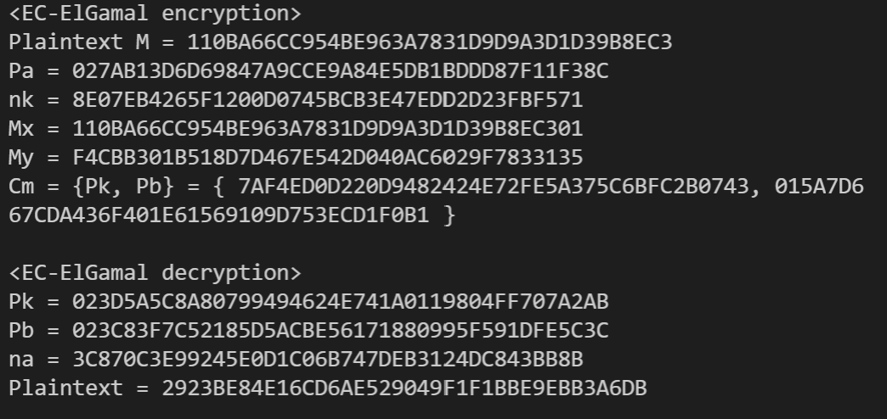

# 網路安全 HW4：EC ElGamal system

## 106021226 蔡皓宇

## **使用說明**

使用make指令直接compile and run

如已經compile過直接呼叫make run

使用make clean清除檔案

輸入格式與IO sample相同，省去空格，密文輸出未滿40個字元會在前補零，解密的明文不補。(因為sample IO我觀察出來是這樣)

並且只支援大寫16進位整數輸入。
## **Output Result**



# **code 講解**

先講解各個代數上的function與struct為何。

# *代數*

```c++
struct fp2
{
    B_int x, y;
};
struct point
{
    B_int x;
    B_int y;
};
struct Ciphertext
{
    B_int Pk;
    B_int Pb;
};
```
這三個結構為整個程式運作會用到的結構，
fp2指的是extension field，由於要計算square root over F_p時需要的Cipolla's algorithm需要把GF(p)擴張到GF(p^2)，因此需要定義這個結構。

而point代表的是橢圓曲線上的點，有x與y座標，以x=0,y=0代表infinity，由於b不等於0因此(0,0)必定不在曲線上，可以放心使用它作為infinity。

Ciphertext只是為了方便儲存密文格式

```c++
point pluspt(point s, point t)

point doubling(point P)
```
這兩個function為橢圓曲線的加法運算，仿照slide中的公式實作而已。

pluspt(s,t)會回傳s+t的值

當s=t的時候呼叫doubling(s)


有了這個兩個運算我們就可以運算scalar multiplication了

```
point scalarmulti(B_int r, point P)
```
這個function輸入大整數r及橢圓曲線上的點P會回傳rP，使用與計算指數時相同的演算法，修改為橢圓曲線上的加法。可以在O(logr)時間完成，由於r是大整數，這對整個系統的加速有顯著的影響。

```c++
int LegendreSymbol(B_int in)
```
這個function為計算Legendre Symbol，在確認點是否可以得到quadratic residue時會用到，回傳值=1代表輸入為quadratic residue，回傳值為-1代表不是，為0代表in % p =0

直接計算 in^(p-1)/2 over F_p即可


```c++
B_int cipolla(B_int in, B_int yp)
```
這個function可以計算squre root，yp=1輸出奇數根，yp=2輸出偶數根，
仿照維基百科所解釋的運算，寫成程式碼即可。

不過其中會呼叫到GF(p^2)上的指數運算，也就是需要GF(p^2)上的乘法運算
```
fp2 fp2multi(fp2 in1, fp2 in2, B_int p, B_int w2)
```
這個function可以進行GF(p^2)上的乘法運算，w2為extension field添加的元素平方。

將兩個元素配方運算回傳即可。

# *資料結構*


首先第一個要處理的是我的大數系統，我的大數系統只能讀取「小寫」的英文字母，因此需要在輸入的時候先轉乘小寫，輸出的時候再轉成大寫。

## **明文轉換**
第二個要處理的是明文轉換為橢圓曲線上的點，使用老師提供的Data embedding，y在明文尾端添加兩個0，確認是不是在曲線上，不是則+1，直到在曲線上為止，這裡可以用上面提及的Legendre Symbol做到。

## **Octet string to EC point** 
再來是還原公鑰到橢圓曲線上的點，前綴的02,03代表y軸座標會是奇數根還是偶數根(計算y平方根 y^2=x^3+ax+b)

這裡參考secg.org的octet string to EC point

但由於輸入已經是16進位整數，因此我們可以直接把前綴的02,03分離出來，後面剩餘的就是x座標，再用Cipolla's algorithn得到y座標即可

解密的時候也相同，可以用一樣的方法把密文還原成橢圓曲線的點。

# **加密解密**
有了上面的資料結構以及function，便可以輕易實現加密與解密

加密：

##### (pointtointeger就是簡單擷取x座標的值而已)
```c++
Ciphertext encryption(point Pm, point Pa, B_int nk)
{
    Ciphertext res;
    res.Pk = pointtoineger(scalarmulti(nk, G));
    res.Pb = pointtoineger(pluspt(Pm, scalarmulti(nk, Pa)));
    return res;
}
```

解密：

```c++
string decryption(point Pk, point Pb, B_int na)
{
    string res;
    point tmp = scalarmulti(na, Pk);
    point Pm = pluspt(Pb, inverse(tmp));
    res = Capsconvert(Pm.x.getString().substr(0, 
    Pm.x.getString().length() - 2));
    return res;
}
```

## **總結**

也是基於第一次作業的大整數運算，額外實作一些橢圓曲獻需要的結構，來完成整個加密系統。
這次又發現我的曲餘數又出錯了，花了不少的時間發現問題，修正。